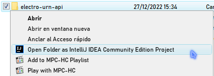
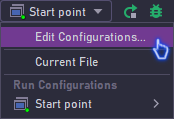
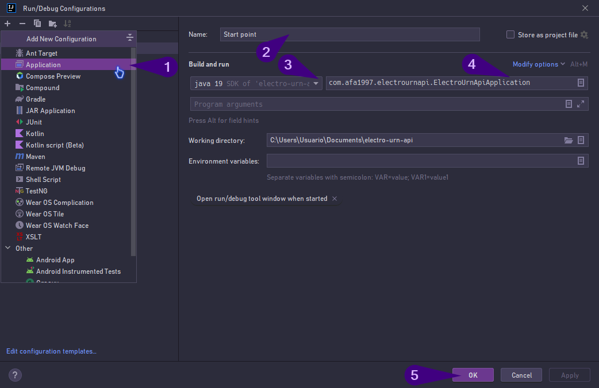

# Electro Urn API

A simple API written with [Spring](https://spring.io/) for voting candidates to various different roles then calculates most voted candidates per role, made as part of a software architecture assignment, from a course involving system analysis and development offered by [IFSul](http://www.ifsul.edu.br).<br/>
This project isn't intended to be an actual product to deploy anywhere, and is meant to be used for educative purposes (i.e.: learning how to develop your Spring API), for people looking to learn about Spring.

## What are the specifications of the assignment?

Below are details on what the assignment required to do, listing these terms can help you understand the ins and outs how to create an API and what's important about it, as well as to give relevant context about its functionality.

* Voter can vote a candidate for a specific role, the assignment dictates there must be 5 roles one may choose from: "president", "governor", "senator", "federal representative" and "intrastate representative".
* There's two turns to vote: the first begins automatically, and the second via an API call (manually), but only if president and/or governor weren't chosen yet (the rest of the roles must have a "winner").
* Both candidates and turns needed to be loaded automatically upon system start-up: for that end, the structure is created via the Spring MVC framework and the sample data is then, loaded from the queries at [`/src/main/resources/data.sql`](/src/main/resources/data.sql).
* Send a request to vote for a candidate, and being able to submit a blank vote: to achieve this, the user sends data via POST as described in the next section. If the user skipped sending a candidate ID and/or role ID, the vote is automatically blank. ID of the voter is a must, otherwise the vote is rejected.
* As described before, calculate winners per role and end turn. Start second turn if there's at least a president or governor to be voted, the second turn will only end when there's a winner for these two missing roles.
* Include the following files: [SQL script(s)](/src/main/resources/data.sql), [request collections](/postman_collections) via Postman, [source code](/src), [architecture diagram](/models/sw_arch_diagram) and [database model](/models/database), [installation and running instructions](#how-to-use) and any other relevant data/file to the project.

## Calls to API

Below are some examples of calls you can do with [Postman](https://www.postman.com/) or [CURL](https://curl.se/) you can do, more will be added later:

* **GET:** `http://localhost:9999/candidate/1`: find and get data of a candidate that does exist.
* **GET:** `http://localhost:9999/candidate/1000`: get a response for a candidate that doesn't exist, since their ID is out of bounds from the range of IDs within supplied sample data.
* **POST:** `http://localhost:9999/candidate/reg`: register a sample candidate with generic information.
  * **Header:** `Content-Type: application/json`
  * **Body:** `{"first_name": "Test","last_name": "Candidate","date_birth": "1993-06-21"}`

If you're making your requests via Postman, please check the [`/postman_collections`](/postman_collections) folder on this repository for more information.
In this folder, you can find collections that can be downloaded and imported to Postman, these contain various examples of requests you can make to the API while it's working, they're labeled and have sample data.

## Database and software architecture diagrams

As said above, this API is a software architecture assignment, so coding the API while also making the diagrams are part of the required 

## How to use?

The API is set-up to be ran locally, here's instructions on how to install it.

1) Download and install [XAMPP](https://www.apachefriends.org/)
2) Run XAMPP.
3) From XAMPP Control Panel, run Apache and MySQL services.
4) Clone this repository, you can just download it as a ZIP.
5) Copy the files of this repository to a folder, for example in Windows, to: `%USERPROFILE%\Documents\electro-urn-api`. If you cloned by ZIP download, uncompress the files into a directory, otherwise the project files will be mixed up with other files and that will cause issues deleting/managing them later on.
6) Using your IDE of preference, open the folder with the previously cloned files as a project. Below is an example for [IntelliJ IDEA](https://www.jetbrains.com/idea/):<br/>

7) You'll likely need to set up the main class. Considering the example above (in IntelliJ IDEA), this is done by pressing the dropdown next to the `[Run]` toolbar button at the top and selecting the `[Edit Configurations]` menu entry, like this:<br/>

8) Follow the graphical steps in the following picture to define which is the main class, in the project files, it's located at [`/src/main/java/com/afa1997/electrournapi/ElectroUrnApiApplication.java`](/src/main/java/com/afa1997/electrournapi/ElectroUrnApiApplication.java). Do note that you may need to download and install a JDK.
[](help_img/idea64,RunDebug_Configurations_2022-12-27_15-37-41-975.png)
9) When this is done, run the project by pressing the green ":arrow_forward:" button on the top toolbar, and wait until the run log that appears below shows the Tomcat port. This is an example of a message you get:
```
2022-12-27T15:46:02.394-03:00  INFO 8568 --- [  restartedMain] o.s.b.w.embedded.tomcat.TomcatWebServer  : Tomcat started on port(s): 9999 (http) with context path ''
```

Upon first initiation, `the database is created automatically with all the tables and relevant relationships, as well as some sample data to help us test code quickly, so you won't need to do much tinkering.

## Plans

This project is planned to be updated post course completion to add new functionality and to keep practising and experimenting with Spring, I hope it'll be useful to you in your learning!

> :information_source: A wiki is going to be written later on, with resources that could help setting up things and learning Spring, it won't be a full-fledged course but it's planned to be a starting point anyone could use.